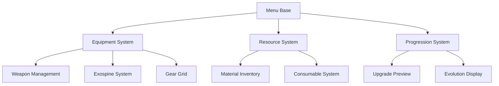

# AAA Menu System Architecture Overview

## Design Philosophy

Our menu system is built on the following core principles, inspired by Stellar Blade:

1. **Focused Equipment Categories**
   - 3 Weapon slots for strategic loadout management
   - 6 Exospine slots for enhanced build variety
   - 20 Gear storage slots with grid layout
   - 10 Outfit storage slots with preview functionality

2. **Quality-Driven UI/UX**
   - Clear visual hierarchy
   - Immediate feedback for all interactions
   - Seamless transitions between states
   - Intuitive navigation patterns

3. **Visual Progression Focus**
   - Real-time equipment preview
   - Clear upgrade path visualization
   - Material requirement tracking
   - Evolution preview system

## Core Systems

### 1. Base Menu Framework
```cpp
class UHackAndSlashMenuBase : public UBaseWidget
{
    // Core navigation functionality
    // State management
    // Input handling
    // Animation system integration
};
```

### 2. Equipment Management
```cpp
class UEquipmentMenuBase : public UHackAndSlashMenuBase
{
    // Weapon slot management
    // Exospine system
    // Gear grid implementation
    // Outfit gallery
};
```

### 3. Resource System
```cpp
class UResourceMenuBase : public UHackAndSlashMenuBase
{
    // Material inventory
    // Consumable management
    // Auto-sorting functionality
    // Category filtering
};
```

### 4. Progression Visualization
```cpp
class UProgressionVisualizer : public UObject
{
    // Upgrade path display
    // Material requirement tracking
    // Evolution preview system
};
```

## Component Interaction



## Memory Management

1. **Widget Pooling**
   - Reusable widget instances
   - Smart cache management
   - Memory optimization strategies

2. **Asset Streaming**
   - Dynamic loading/unloading
   - Preview optimization
   - Resource management

3. **State Management**
   - Clean state transitions
   - Memory cleanup on navigation
   - Reference management

## Performance Considerations

1. **Rendering Optimization**
   - Efficient draw calls
   - Material instancing
   - Texture atlasing

2. **Input Processing**
   - Input buffering
   - Event throttling
   - Response optimization

3. **Animation System**
   - Animation pooling
   - Transition optimization
   - Memory-efficient playback

## Blueprint Integration

1. **Designer Tools**
   - Menu layout customization
   - Visual feedback configuration
   - Navigation flow setup

2. **Runtime Configuration**
   - Dynamic slot adjustment
   - Visual customization
   - Interaction timing

## Integration Points

1. **Combat System**
   - Quick weapon switching
   - Consumable activation
   - Equipment stats application

2. **Inventory System**
   - Seamless item transfer
   - Storage management
   - Category organization

3. **Animation System**
   - Menu transitions
   - Equipment preview
   - Feedback effects

## Future Extensibility

1. **New Equipment Types**
   - Modular slot system
   - Extensible categories
   - Custom preview support

2. **Enhanced Visualization**
   - Advanced preview features
   - New progression displays
   - Custom effect systems

3. **Platform Adaptation**
   - Input method flexibility
   - Layout adaptability
   - Performance scaling 