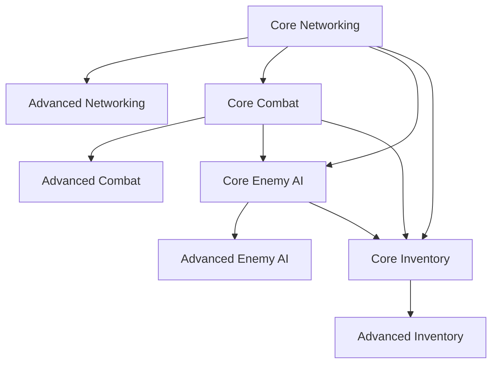

# Feature Classification Guide

This document classifies features in our UE5 project as either **Core** or **Advanced**. This classification helps teams prioritize implementation and prevents smaller or newer teams from being overwhelmed by features they may not immediately need.

## Classification Definitions

### Core Features
Core features are essential for basic gameplay functionality. These should be implemented first and are required for a minimum viable product.

### Advanced Features
Advanced features enhance gameplay but are not essential for basic functionality. These can be implemented later in the development cycle or skipped entirely for smaller projects.

## Enemy System

### Core Features
- ✅ **Basic Enemy AI**: Simple patrol and chase behavior
- ✅ **Health System**: Basic damage and death handling
- ✅ **Animation State Machine**: Basic locomotion and attack animations
- ✅ **Spawn System**: Simple enemy spawning
- ✅ **Basic Perception**: Line-of-sight detection

### Advanced Features
- 🔶 **Advanced Behavior Trees**: Complex decision making and tactics
- 🔶 **Group Coordination**: Enemies working together
- 🔶 **Advanced Animation Blending**: Smooth transitions and procedural animation
- 🔶 **Dynamic Difficulty Adjustment**: Adapting to player skill
- 🔶 **Advanced Bone Dynamics**: Physics-based reactions to impacts

## Combat System

### Core Features
- ✅ **Basic Melee Combat**: Simple attacks and blocking
- ✅ **Projectile System**: Basic ranged attacks
- ✅ **Hit Detection**: Collision-based damage
- ✅ **Basic Feedback**: Hit effects and sounds
- ✅ **Health/Damage**: Simple health management

### Advanced Features
- 🔶 **Combo System**: Complex attack chains
- 🔶 **Weapon Customization**: Modular weapon system
- 🔶 **Advanced Hit Reactions**: Context-sensitive reactions to damage
- 🔶 **Locational Damage**: Different effects based on hit location
- 🔶 **Advanced Physics Interactions**: Realistic physics-based combat

## Itemization System

### Core Features
- ✅ **Basic Inventory**: Item storage and management
- ✅ **Item Pickup**: Collecting items in the world
- ✅ **Simple Stats**: Basic item properties
- ✅ **Equipment System**: Wearing/using items
- ✅ **Item Categories**: Organizing items by type

### Advanced Features
- 🔶 **Crafting System**: Creating new items from components
- 🔶 **Procedural Generation**: Randomized item properties
- 🔶 **Economy System**: Trading and value calculation
- 🔶 **Durability/Degradation**: Items wearing out over time
- 🔶 **Set Bonuses**: Special effects for wearing matching items

## Networking

### Core Features
- ✅ **Basic Replication**: Essential gameplay state synchronization
- ✅ **Client-Server Architecture**: Authority-based gameplay
- ✅ **Basic Prediction**: Simple movement prediction
- ✅ **RPC System**: Server-client communication
- ✅ **Session Management**: Creating and joining games

### Advanced Features
- 🔶 **Advanced Prediction**: Complex interaction prediction
- 🔶 **Bandwidth Optimization**: Advanced compression techniques
- 🔶 **Distributed Physics**: Server-authoritative physics with client prediction
- 🔶 **Anti-Cheat Measures**: Detecting and preventing cheating
- 🔶 **Cross-Platform Play**: Supporting multiple platforms in the same session

## UI System

### Core Features
- ✅ **HUD Elements**: Health, ammo, basic status
- ✅ **Main Menu**: Title screen and basic options
- ✅ **Inventory Display**: Simple item management
- ✅ **Dialog System**: Basic conversation UI
- ✅ **Pause Menu**: Game pausing and options

### Advanced Features
- 🔶 **Dynamic HUD**: Context-sensitive UI elements
- 🔶 **Advanced Inventory Management**: Sorting, filtering, comparing
- 🔶 **Customizable UI**: User-adjustable interface
- 🔶 **Accessibility Features**: Color blindness support, text scaling
- 🔶 **3D UI Elements**: Diegetic interface elements

## Implementation Recommendations

1. **For Small Teams (1-5 people)**:
   - Focus exclusively on Core Features
   - Implement only the Advanced Features that are critical to your game concept

2. **For Medium Teams (5-15 people)**:
   - Implement all Core Features first
   - Prioritize Advanced Features based on gameplay importance
   - Consider using marketplace assets for some Advanced Features

3. **For Large Teams (15+ people)**:
   - Implement all Core Features with high polish
   - Assign specialized team members to Advanced Features
   - Consider custom implementations of all features for maximum control

## Feature Dependency Map

Some features depend on others. Here's a simplified dependency map:

For a more detailed dependency map, see the [Technical Design Documentation](UE_Pattern_Libraries/General/TechnicalDesign.md). 