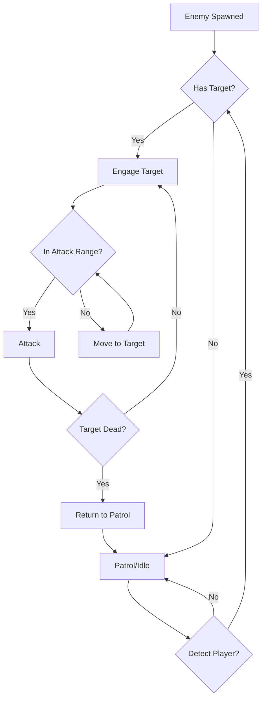
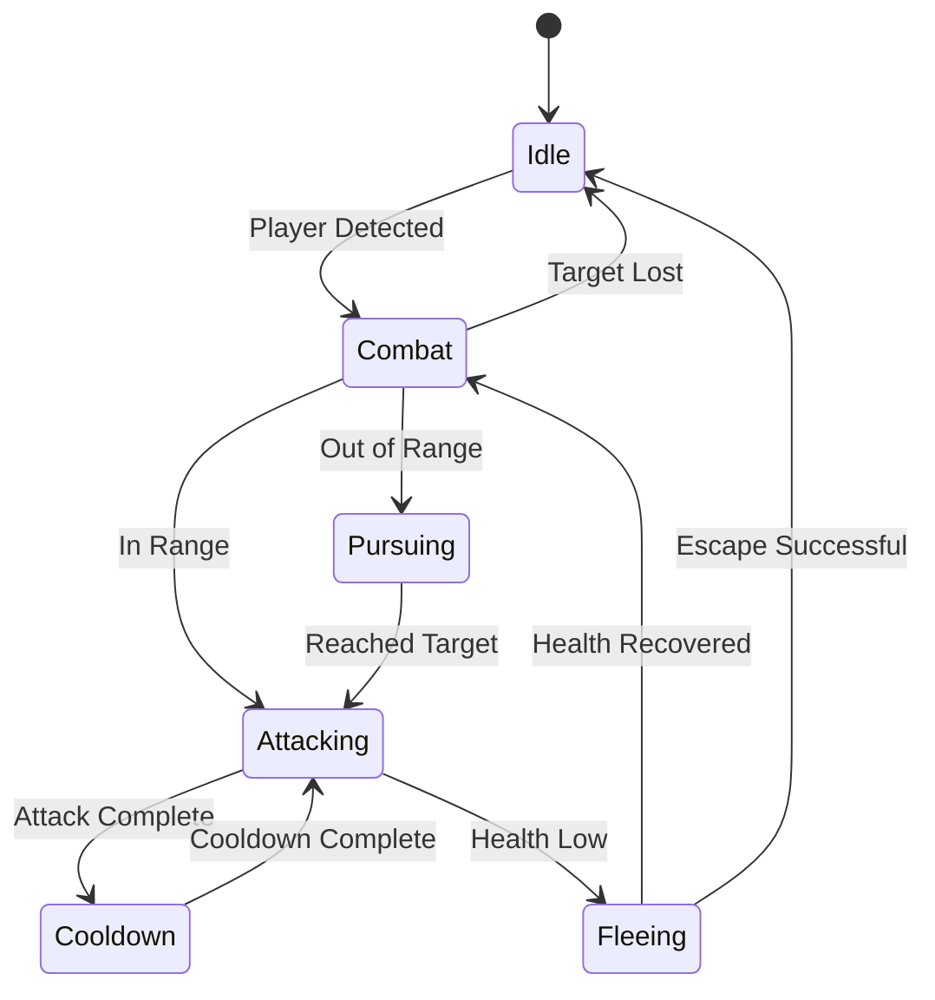
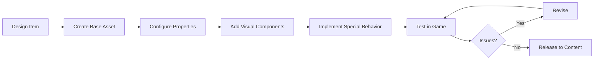
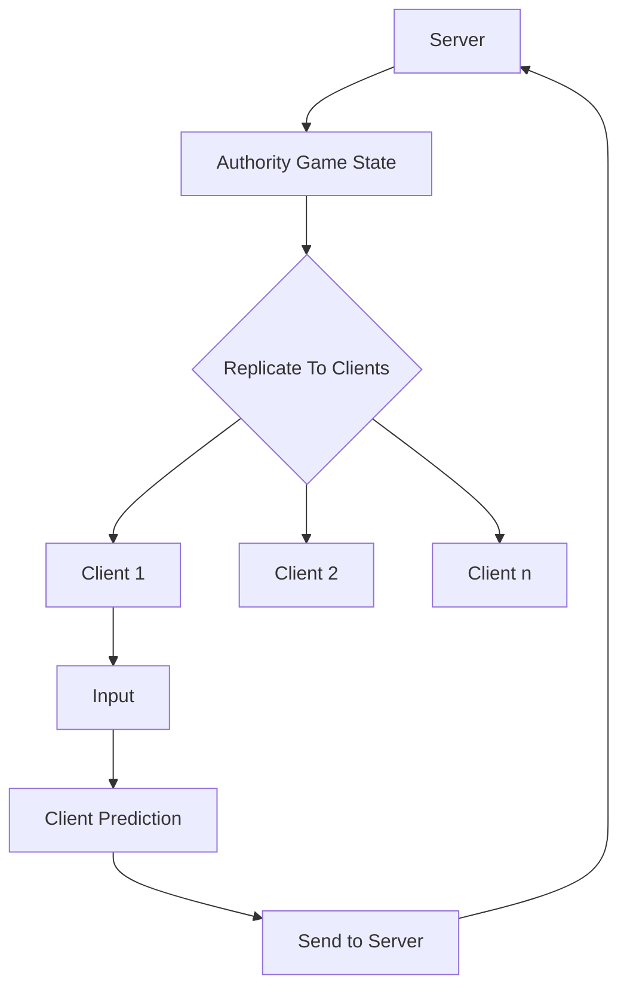

# Visual System Diagrams

This document contains visual diagrams for major systems in our UE5 project. These diagrams are designed to help new team members quickly understand complex systems without having to read extensive documentation.

## AI Flow Diagram

## Combat State Transitions

## Item Creation Pipeline

## Replication Architecture

## How to Use These Diagrams

These diagrams are meant to provide a high-level overview of complex systems. For detailed implementation guidelines, refer to the specific documentation for each system:

- [AI System Documentation](UE_Pattern_Libraries/AI_Pattern_Library)
- [Combat System Documentation](UE_Pattern_Libraries/Combat_Pattern_Library)
- [Itemization Documentation](Itemization_System/AAA_Itemization_System.md)
- [Networking Best Practices](Global_Best_Practices.md#networking)

## Adding New Diagrams

When adding new features or systems to the project, consider creating a visual diagram to help other team members understand the system quickly. You can use [Mermaid](https://mermaid-js.github.io/) syntax as shown above, or add image files to the repository. 